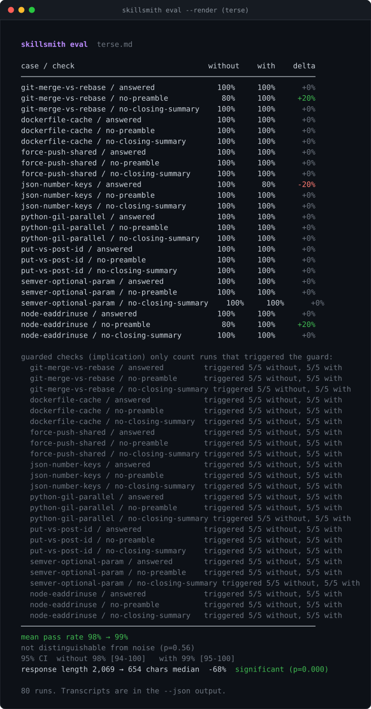

<div align="center">

# terse

**One reflex for coding agents: answer first, cut the padding.**

[](SKILL.md)
[](output-styles/terse.md)
[](https://github.com/daronthedragon/skillsmith)
[](LICENSE)

</div>

---

A coding agent's answer is usually one or two lines. Everything wrapped around it — *"Great question! Let me help. Here's what's happening… I hope this helps!"* — is the reader's tax. terse is a single reflex that cuts it: **open with the answer, keep only what changes the reader's next action, stop.**

It is one behavior, not a toolkit. Like [ponytail](https://github.com/DietrichGebert/ponytail) makes an agent write less code, terse makes it write less *around* the answer. It ships as a Claude Code **output style** — folded into the system prompt for the whole session, so the reflex holds from the first turn instead of being re-injected by a hook on every prompt.

## The reflex

Instead of:

```
Great question! Let me help you with that. So, the issue you're seeing is
because the port is already in use. Here's what's happening: another process
has bound to 3000. To summarize, you'll want to free the port. I hope this helps!
```

terse does:

```
Port 3000 is already bound. Free it: `lsof -ti:3000 | xargs kill`.
```

Same answer. The receipt is the command, not three sentences restating the problem.

## Install

terse is a Claude Code **output style** — a single file that gets folded into the system prompt. No hook, no runtime, no dependency.

**User-wide** (every project):

```bash
git clone https://github.com/daronthedragon/terse.git
cp terse/output-styles/terse.md ~/.claude/output-styles/terse.md
```

Then turn it on by adding one line to `~/.claude/settings.json`:

```json
{ "outputStyle": "terse" }
```

**Per-project** — drop the file in `.claude/output-styles/terse.md` and set the same `outputStyle` field in the project's `.claude/settings.json`. Off again by removing the field (or setting it to `"default"`).

Other agents (Cursor, Windsurf, Cline, or anything that reads [`AGENTS.md`](AGENTS.md)) get the same reflex from the platform rule files in this repo — see [Everywhere else](#everywhere-else).

## Levels

Three output styles ship, so you can dial how hard the reflex cuts. Set the one you want as `outputStyle`:

| Level | File | Cuts |
|---|---|---|
| `terse-lite` | [`output-styles/terse-lite.md`](output-styles/terse-lite.md) | Drops the greeting and the recap; leaves room for one line of context. |
| `terse` (default) | [`output-styles/terse.md`](output-styles/terse.md) | Answer first, one receipt, no recap — the measured −68%. |
| `terse-ultra` | [`output-styles/terse-ultra.md`](output-styles/terse-ultra.md) | The answer in one or two sentences, nothing around it. |

Copy the levels you want into `~/.claude/output-styles/` and switch by changing the one `outputStyle` line. Off again by setting it to `"default"`.

## Does it actually work?

A skill is worth having only if a measurement shows it changing behaviour. terse ships an eval ([`eval.json`](eval.json)) that runs eight verbosity-tempting questions — compare-and-contrast, "why does X happen", safety judgements, nuance traps like *"does the GIL prevent all parallelism?"* — with and without the output style active, through `claude -p`, and checks each answer for:

- **`answered`** — the correct answer is still present (brevity must not drop the answer)
- **`no-preamble`** — no lead-in boilerplate (*"Sure", "Great question", "Let me", "Here's"*)
- **`no-closing-summary`** — no recap tail (*"In summary", "I hope this helps"*)

Those binary checks turned out to be blind to terse's real effect (the model has no boilerplate phrases to cut), so the eval also measures the **magnitude** that matters — the length of the answer — and compares the two arms with a Mann-Whitney U test. That is the metric that shows the win.

### The measured result: −68% response length, significant

This eval measures the **shipped artifact** — the output style, staged exactly as you install it (`.claude/output-styles/terse.md` + `outputStyle` in settings), not a different form of the rules. Run against `claude -p` (Claude Code 2.1.236), 8 cases × 5 repeats, all 80 runs exited 0. Full report: [`eval-report.json`](eval-report.json), captured with [runshot](https://github.com/daronthedragon/runshot).

<p align="center">
  
</p>

**terse cuts replies to a third — median 2,069 → 654 characters, −68%, Mann-Whitney p = 2.7e-14.** That is a real, significant behavioural change, and it is the same order as ponytail's number on the other axis: ponytail writes ~54% less *code*, terse writes ~68% less *around the answer*.

Two details the table shows that the headline does not. The padding checks are not entirely flat: on the two questions where the base model *did* reach for a lead-in (`git-merge-vs-rebase`, `node-eaddrinuse` — 80% clean without), terse took them to 100%. And one run cost an `answered` check: on `json-number-keys` terse replied *"`json.dumps` coerces the int `1` into `"1"` — the value survives, the type doesn't"*, which is correct but never plainly says "no, keys must be strings", so the answer-presence regex did not credit it. **39/40** on answer presence, not a clean sweep — that is the honest number, and it is the kind of thing a brevity skill has to be watched for.

The interesting part is *how* the measurement found it. The pass-rate checks came back flat — every arm near 100% — because the base model in headless mode **never says "Great question" or "I hope this helps" to begin with.** It has no boilerplate phrases to cut; it is verbose in a subtler way, with long explanations. A binary present/absent check is blind to that. What catches it is measuring the **magnitude** — the length of the answer — and testing the two arms with a non-parametric Mann-Whitney U. On that axis the skill's effect is unmistakable and significant.

This is the lesson worth keeping: **a skill whose whole value is "less of something" cannot be measured by a checklist.** The first version of this eval reported "no effect" from the binary checks and was wrong — it was measuring the wrong quantity. The magnitude metric is what tells the truth, and it is now part of [skillsmith](https://github.com/daronthedragon/skillsmith)'s eval for exactly this class of skill.

### The rules were rewritten against a measurement, not a hunch

The first rule set targeted boilerplate — *"Sure", "Great question", "I hope this helps"*. A strong model rarely says those, so the rules were aiming at padding that was not there. The current rules target what a strong model actually does: **over-explanation** — answering the question next to the one asked, adding the mechanism nobody requested, inflating one line into a headed list to look thorough — and they end with an explicit cut pass over the drafted reply.

That change was A/B'd, not assumed. Both rule sets were run against the same eight prompts, same repeats, same harness — the only difference being which file got staged as the output style:

| | old rules | new rules |
|---|---|---|
| median reply, skill arm | 1,159 chars | **627 chars** |
| vs. its own baseline | −41.5% | **−68.7%** |
| answer still present | 40/40 | 40/40 |

Head-to-head on identical prompts, the new rules cut **another −46%** off what the old rules left — Mann-Whitney U = 299.5, **p = 1.5e-6**, n = 40 per arm — with no loss on answer presence in that pair of runs. The old rules are not in the repo; this table is why.

## Why an output style, not a hook

ponytail keeps itself alive with a `UserPromptSubmit` hook: a script that re-injects its rules into the context on *every* prompt. That works, but it spends tokens each turn, adds a runtime you have to trust, and shows up as noise in the transcript.

terse takes the other door Claude Code offers. An **output style** is folded into the system prompt once, for the whole session — the same place the base instructions live — so the reflex is present from the very first token and never has to be re-asserted. No per-turn script, no injected preamble, nothing to keep running. A skill that is *purely* a behavior (not a tool it needs to call) belongs in the system prompt, and that is exactly what an output style is.

The trade-off is honest: a hook can react to what you just typed; an output style cannot. terse doesn't need to react — it is a constant stance, not a conditional one — so the cheaper, quieter mechanism is also the correct one.

## Everywhere else

The same reflex ships for non-Claude agents as plain rule files, so terse isn't Claude-only:

| Agent | File |
|---|---|
| Cursor | [`.cursor/rules/terse.md`](.cursor/rules/terse.md) |
| Windsurf | [`.windsurf/rules/terse.md`](.windsurf/rules/terse.md) |
| Cline | [`.clinerules/terse-rules.md`](.clinerules/terse-rules.md) |
| Any (AGENTS.md convention) | [`AGENTS.md`](AGENTS.md) |

Each carries the identical rule set — answer first, one receipt, cut the padding — in the format that platform reads.

## License

MIT
